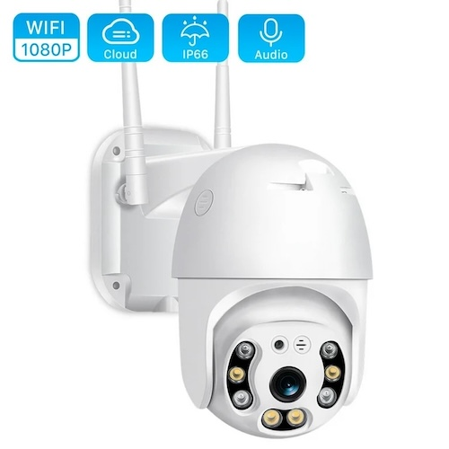
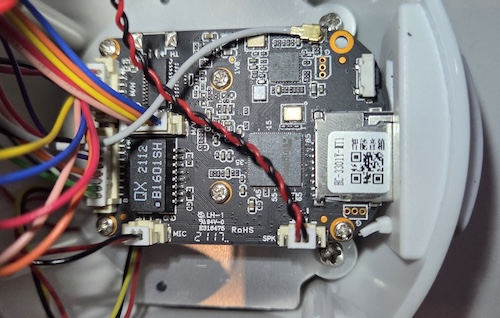
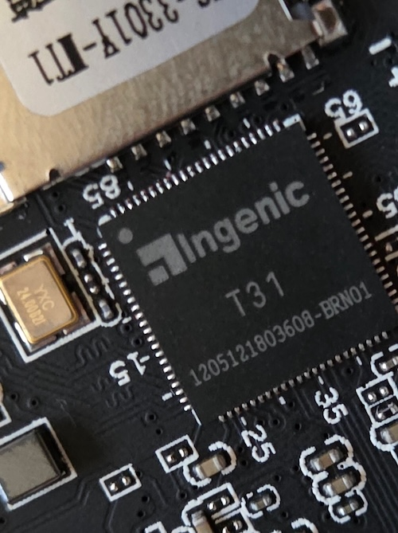
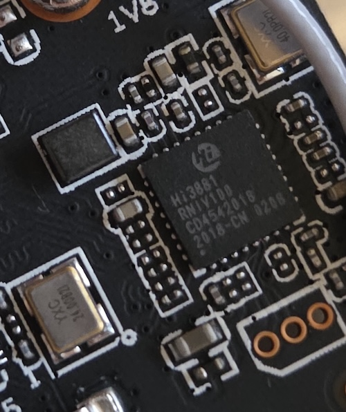
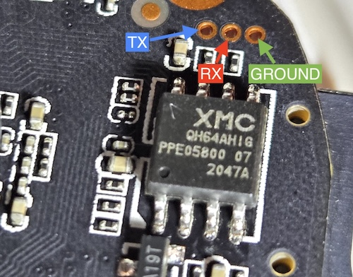

# Tuya Outdoor IP Camera PTZ 1080P HD

This repository contains internal information about a Tuya IP camera.

All the information was obtained via telnet access to the camera after discovering the default credentials using the UART serial communication and digging inside the firmware.

See the various `.md` files for more details.

* Brand: Loosafe
* Model: IPC-T20000 / V6202IR-SC2332
* Firmware Version: V1.6.2_20201222_CSC2332_HKIPC
* Board: ISVP (Ingenic XBurst T31 SoC)
* DRAM:  64 MiB
* Flash Chip: XM25QH64A
* Image Name: Linux-3.10.14__isvp_swan_1.0__
* Image Type: MIPS Linux Kernel Image (lzma compressed)

## Tuya Camera

## Circuit Board

## Ingenic XBurst T31 SoC

## WiFi Module Hi3881

## Flash Chip XM25QH64A (XMC-QH64AHIG) & UART Pins

